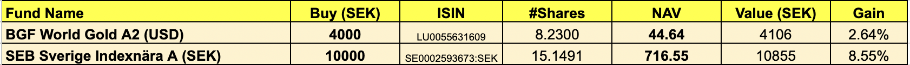
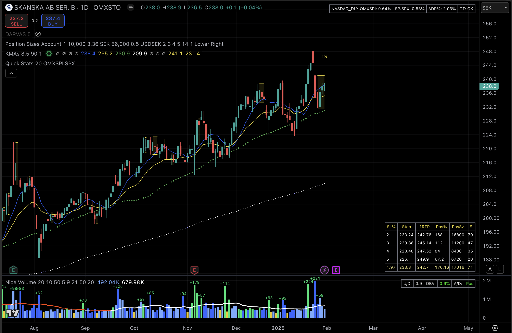
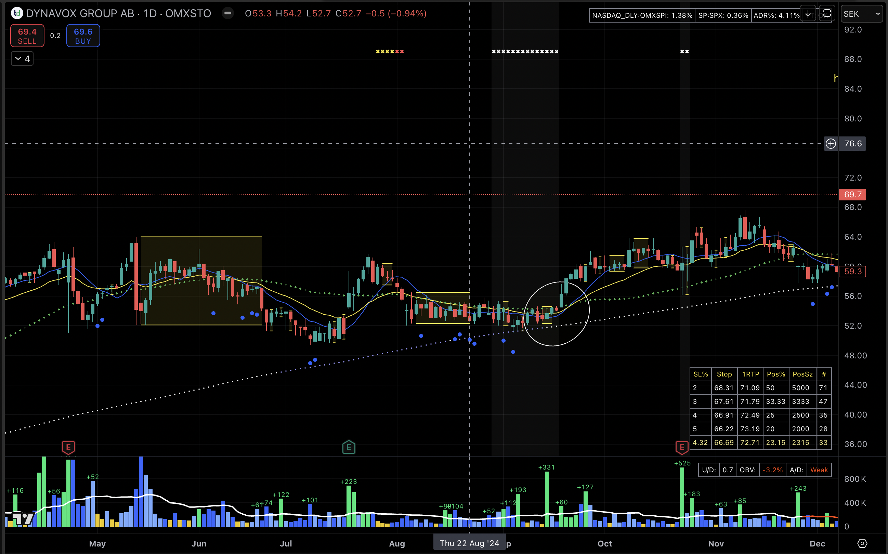
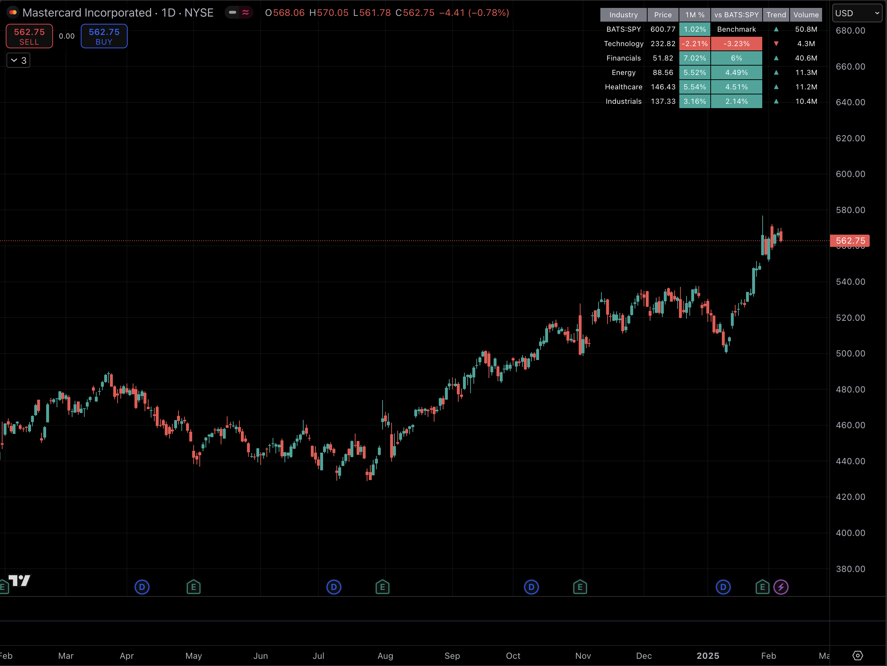
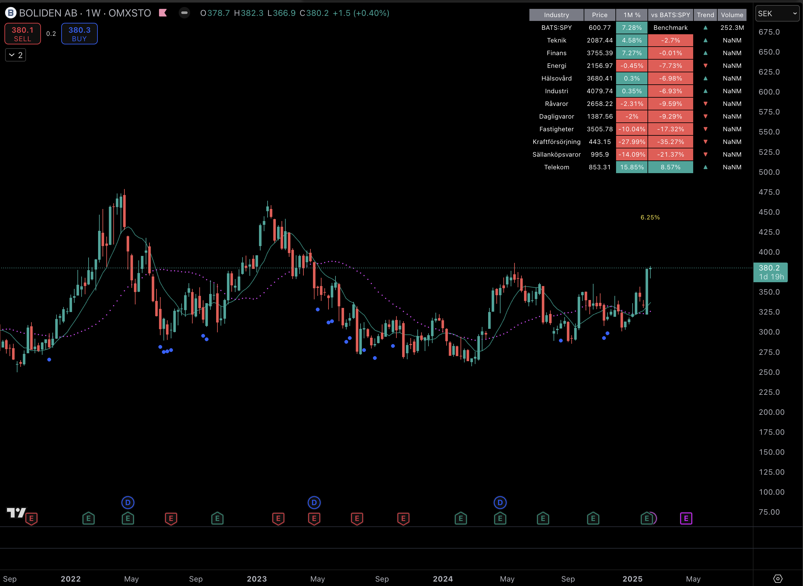
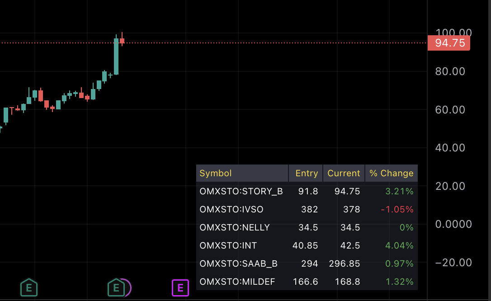

# Stocks
> Things related to stocks

## Google Sheet, AppScript and AppSheet

### Create sortable columns

Have a look at this [video](https://youtu.be/yMr-fz7ObFE?si=VTuzY3f3Dfp4VRuE)

Here we show how to create a filter view of a table so that it can be sorted
based on the values in the column of choice. By clicking on the column header
we can toggle between ascending or descending sort order.

### Create a balanced stock portfolio using Google Sheet and AppScript

Have a look at this [video](https://youtu.be/DV2nnXCDXNk?si=8qfXGwztY7jiBaQz)

The AppScript used can be found [here](AppScript/balanced_portfolio.gs)

### How to calculate the current value of your Investment Fund Shares

From within your Google Sheet, it is easy to get hold of the current
price of an ordinary stock or index by using the `=googlefinance(TICKER, "price")`.

It is a little trickier to get hold of the NAV (Net Asset Value) for
an Investment Fund, but here is a way to do it; we will parse the relevant
page from Financial Times, by using an XPath expression, like this:

```
=importxml(CONCAT("https://markets.ft.com/data/funds/tearsheet/summary?s=",CELL),"/html/body/div[3]/div[2]/section[1]/div[1]/div[1]/div[1]/div[2]/ul[1]/li[1]/span[2]","en_US")
```

Make sure to replace the `CELL` with the Google Sheet cell number where the funds
`ISIN` number is located. Note that if it is a Swedish fund then you have to append
a `:SEK` to the ISIN number.

Example:



Also, with stocks it is easy to get hold of the change since yesterday using the:
`=googlefinance(TICKER, "changepct")` function. With a fund, getting the value
as shown above we, can make us of a simple AppScript running at the end of the day
to copy the fund NAV value into a _"yesterdays NAV"_ cell.

Modify the following script for the relevant Sheet names and Cells, then run
it by a trigger (see video below, how to setup a trigger) just before midnight every day:

```javascript
/*
 * Run this function at the end of day to copy the todays value,
 * to be used "tomorrow" as the "yesterday value".
 */
function yesterdaysValues() {
  // Get the spreadsheet and sheets.
  var ss = SpreadsheetApp.getActiveSpreadsheet();
  // Sheet containing the value to copy (Source)

  var sourceSheet = ss.getSheetByName("Portfolio");
  var targetSheet = sourceSheet;

  // Get the cell containing the value to copy (Source Sheet)
  var sourceValueCell = sourceSheet.getRange("J22");

  // Get the target cell (Target Sheet)
  var targetRange = targetSheet.getRange("N22");

  // Copy the value
  targetRange.setValue(sourceValueCell.getValue());
}
```

### Record a portfolio value once a day

Here we will record a portfolio value by appendng the value to a table,
located in another Sheet, once a day, together with the date.

We setup a trigger to run the AppScript once a day.

This will make it possible to produce nice graphs/diagrams of the portfolio progress.

Have a look at this [video](https://youtu.be/lW_x_L9ncuI?si=vB41r96hh3aVIKw0)

The AppScript used can be found [here](AppScript/record_portfolio_value.gs)

### A Mobile App for displaying portfolio progress diagrams

Have a look at this [video](https://youtu.be/xnGumHzS5TA?si=-cNkXFTiTh0D_2J6)
where we build a simple app that you can download to your Mobile to track
the progress of your Stock Portfolio.

## TradingView

[TradingView](https://www.tradingview.com/about/) is a nice charting platform
for stocks etc, where it is possible to write your own chart indicators in
a programming language called `PineScript`.

I've written and published a number of [PineScripts](https://www.tradingview.com/u/kruskakli/#published-scripts)
and here I'll go through my own personal favorites.

Let's start by having a look at my typical setup, and then explain the various indicators I'm using:



This setup consist of a main area where the actual stock chart is shown and a smaller area at the bottom
that show the traded volume.

The main area is using three "indicators"/PineScripts:

* `KMAs` - A number of plotted _moving averages curves_, the _inside bars_ indicator and more...
* `Position Sizes` - Shows a table of suggested position sizes based on the account size and choosen risk percentage.
* `Quick Stats` - Show some info up in the right corner such as: `Minervini's Trend Template` and the `Average Daily Range in percent`   

The bottom area shows the traded volume, where a number of volume related indicators are baked in.
The indicator is named: `Nice Volume` and contains:

* The colors of the bars have a meaning, e.g when a `Pocket Pivot` has occured.
* The plotted moving average color is changed depending on the trend of the Acc/Dist volume indicator.
* A small table shows more volume related figures.

### KMAs - Key Moving Averages

This is a script that combines many indicators, which each, easily can be turned on/off via the TradingView config menu.

The script can be found [here](PineScript/kmas.pine).

A number of Moving Averages are displayed (depending on the timeframe used).
The following (default) values are used:

* `Daily` : MA10, EMA21, MA50, MA200
* `Weekly`: MA10, MA40
* `Intraday`: Daily MA5 and EMA65

The MA200 will be presented in white when `On-Balance Volume` is positive, else it is presented in blue.

The `Inside Bars` indicator will draw a shadowed area when succeding `candles` are contained within
an earlier (larger) candle, thus indicating an area of uncertainty, from where potential breakouts
could occur. 

It is also possible to display a `Bollinger Band` and to display the `close/ema21 ratio in percent`.

But wait, there is more, look at this chart:



**Keltner Channels** use ATR to calculate the upper and lower bands, while **Bollinger
Bands** use standard deviation.
The **BB/KC Squeeze Indicator** combines the concepts of Bollinger Bands and Keltner
Channels to identify periods of low volatility or “squeeze” conditions. A squeeze
is identified when the Bollinger Bands are within the Keltner Channels, indicating
that the price may soon break out of its current range and is plotted as white marks
at the top with a faint shadowed "curtain". Periods of high volatility
on a daily chart is indicated based on the width of Bollinger Bands. It plots a
yellow marker at the top of the chart when volatility is high and increasing/stable,
and a red marker when volatility is high but decreasing. The script helps visualize
when volatility spikes and whether those spikes are potentially ending.
As someone said: _"Trends die after High Volatility"_.

**RoC divergence**: The idea is to identify a possible Bullish Trend Shift.
The rules are:

1. ROC(10) is rising.
2. ROC(30) is falling.
3. RSI(14) < 50

When all the rules are triggered this is indicated with a blue circle below the candle.
Note that this doesn't give you a Buy signal; you also have to get a confirmation from
the price graph, e.g by crossing a trend line.
(_Idea curtesy: Tobbe Rosèn_)  

### Position Sizes

The script can be found [here](PineScript/position-sizes.pine).

When trading, position sizing and risk calculation is the key to become successful.
 
We need to keep the losses small and adjust the position size according to what
risk we are prepared to take for the planned Entry.

Based on the Account Size and the max percentage we want to risk for any trade,
we calculate, for a number of fixed max Loss percentages:

* The Position size, both in percent and in the selected currency.
* Number of shares to buy.
* Where to put the Stop Loss.
* Where a 1RTP (1 Risk amount Take Profit) level could be put .

We also calculate the numbers based on the ATR times a multiple.

The values are presented in a table format and will hopefully aid in selecting
a suitable Stop Loss (based on the chart situation) and hence the proper Position Size.

We also allow for expressing the Account size in currencies other than USD.

* Account Size in USD and trading US stocks: select USD
* Account Size in SEK but trading US stocks: select USDSEK

This [video](https://youtu.be/XE9M9t9W7vw?si=lPR7odkRA_nR_NiR) explain how to
use this Position Sizes Account table.

### Quick Stats

The script can be found [here](PineScript/quick-stats.pine).

Quick Stats - shows some important info at the top right corner

* We display the percentage change of two selected Indices.

* *ADR%* - Average Daily Range in percent
(To quote @qullamaggie: " High ADR is Gold, low ADR is shit...")

* *Trend Template* - indicate if the stock is in a good Up Trend
We calculates the Trend Template as described by Mark Minervini in his book: "Trade like a stock market wizard"
For a stock to be considered all the rules has to be fullfilled.
The only rule this indicator doesn't implement is the IBD Relative Strength ranking.
Rules:
  - close > MA-50 > MA-150 > MA-200 , each condition that is true gets one point.
  - The current stock price is at least 30 percent above its 52-week low, gets one point
  - The current stock price is within at least 25 percent of its 52-week high, gets one point.
  - The 200-day moving average line is trending up for at least 1 month (preferably 4–5 months), gets one point.
  - When we get 6 points, all the rules are fullfilled and we display an OK; else we show the number of points (X).


### Nice Volume - The bottom (volume) area

The script can be found [here](PineScript/nice-volume.pine).

This Volume panel is inspired by _TradingLions_ ditto.

Four different colors are used for the Volume columns:

* Up/Down down columns.
* Pocket Pivot columns.
* Lowest of 10 periods.

A moving average is plotted where the color is changed
depending on the trend of the Acc/Dist volume indicator.

A table is displayed containing some Volume indicators:

*Up/Down volume ratio:* where a value above 1.5 is shown
in green, indicating that more than 50% och the volume
is positive; where a value below 0.5 is shown in red.

*On-Balance Volume trend:* the percentage OBV is above/below
a moving average is displayed; positive/negative in green/red.

*The trend*  (Positive/Negative/Weak) of the *Acc/Dist indicator*
is displayed in either green/red.


### Comparing Sectors

A dynamic industry sector performance comparison indicator that helps traders
and investors track relative strength across different market sectors in real-time.

The script can be found [here](PineScript/industry-indices-comparison.pine).



The displayed table compares up to 5 industry sector ETFs against a benchmark
index (default: SPY).

The indicator helps identify:

1. Sector rotation patterns through relative performance
2. Leading and lagging sectors vs the broader market
3. Volume trends across different sectors
4. Sector-specific momentum through trend indicators

For traders it can be valuable information to know if a potential trade is
in a stock belonging to a currently strong sector.

[Here](PineScript/industry-indices-comparison-SWE.pine) is the script tailored for the Swedish markets.



### My Indicator

A comprehensive indicator that combines multiple technical analysis tools in one view.

The script can be found [here](PineScript/my-indicator.pine).

Features:
* Key Moving Averages displayed based on timeframe (Daily, Weekly, Intraday)
* Average Period Range Table showing:
  - Index and its change
  - Trend Template status
  - Average Period Range percentage
  - Stock's sector
* Popular Candlestick Patterns including:
  - Evening Star
  - Morning Star
  - Shooting Star
  - Hammer
  - Gravestone
* Minervini's Trend Template implementation showing when a stock is in a strong trend

### Portfolio Tracker

A tool for monitoring your current trade portfolio in real-time.

The script can be found [here](PineScript/portfolio-tracker.pine).



Features:
* Track up to 10 different stocks simultaneously
* For each position, displays:
  - Entry price
  - Current price
  - Percentage change from entry
* Color-coded performance indicators (green for profit, red for loss)
* Configurable table position on the chart
* Easy setup through TradingView's indicator settings

